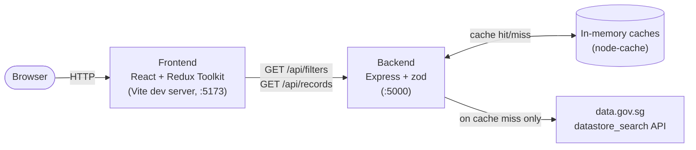

# SG Health Analytics

A full-stack app for exploring [data.gov.sg's "Average daily hospitalised / ICU cases by Epi-week"](https://data.gov.sg/datasets?topics=health&query=&resultId=d_0d1da54a73733d33e40f662f757af537) dataset — filter by clinical status, age group, and epi-week, sort and paginate the raw records, and see computed summary insights (averages, week-over-week change, peak week, ICU:Hospitalised ratio) that update to match whatever's currently filtered.

## Stack

- **Frontend**: React + TypeScript + Vite, Redux Toolkit + RTK Query, MUI
- **Backend**: Node + TypeScript, Express, zod validation, in-memory caching (`node-cache`)
- **Shared**: a type-only `packages/types` package used by both
- **Monorepo**: pnpm workspaces

## Setup

Requires Node 22+ and [pnpm](https://pnpm.io).

```bash
pnpm install

# copy env templates and fill in as needed (defaults work as-is — no
# secrets are required to run this locally, see ADR.md)
cp backend/.env.example backend/.env
cp frontend/.env.example frontend/.env

pnpm dev
```

This starts the backend (`http://localhost:5000`) and frontend (`http://localhost:5173`) together. Open the frontend URL in a browser.

Other useful commands, run from the repo root:

```bash
pnpm test       # runs both workspaces' test suites
pnpm lint       # ESLint across the whole monorepo
pnpm build      # type-checks/builds both workspaces
```

To check the infrastructure code (no AWS account or deployment needed):

```bash
cd infra
pnpm exec cdk synth
```

## Architecture



The frontend never calls data.gov.sg directly — every request goes through our backend, which validates input, applies caching, and (for `/api/records`) computes insights server-side. See [ADR.md](./ADR.md) for why.

### Backend request flow

There are two independent endpoints and three caches, each serving a different concern:

| Endpoint | Reads from | Notes |
|---|---|---|
| `GET /api/filters` | full-dataset cache | Unique values per filterable field, for populating the UI's filter dropdowns. No request payload. |
| `GET /api/records` (no filter) | records-proxy cache (`items`) + full-dataset cache (`insights`) | Insights reuse the same cached dataset `/api/filters` already loaded — no extra fetch. |
| `GET /api/records` (filtered) | records-proxy cache (`items`) + filtered-insights cache (`insights`) | Insights are recomputed over every row matching the filter (not just the current page), so they stay consistent with what's displayed. |

Why three caches instead of one: `/api/records`'s insights always need every matching row, regardless of pagination, while its `items` only need the current page — those are different access patterns with different natural cache keys. Full reasoning is in `PLAN.md`'s Decisions Log (#10).

### Project structure

```
backend/
  src/
    routes/        GET /api/filters, GET /api/records
    services/       data.gov.sg client (fetch, pagination, retry)
    cache/          three caches (see above)
    insights/       average/week-over-week/peak-week/ratio calculations
    config/         env loading + validation
frontend/
  src/
    redux/          store, RTK Query api, filters slice
    containers/      components wired to Redux/data-fetching
    components/      pure, props-only components
packages/types/     shared TS types (type-only, no build step)
infra/              AWS CDK app (VPC/ECS/ALB, S3/CloudFront)
```

## API contract

Both endpoints return `{ success: true, data: {...} }` on success, or `{ success: false, error: { message } }` on failure (400 for invalid input, 502 for an upstream data.gov.sg failure).

### `GET /api/filters`

No query parameters. Returns the unique values for each filterable field:

```json
{
  "success": true,
  "data": {
    "clinical_status": ["Hospitalised", "ICU"],
    "age_groups": ["0 - 11 years old", "12 - 59 years old", "60 years old and above"],
    "epi_week": ["2023-09", "2023-10", "...", "2024-08"]
  }
}
```

### `GET /api/records`

| Param | Type | Default | Notes |
|---|---|---|---|
| `limit` | number (1–100) | 100 | Page size |
| `offset` | number | 0 | Pagination offset |
| `filters` | JSON string | none | e.g. `{"clinical_status":"ICU","age_groups":["0 - 11 years old","60 years old and above"]}` — one value or an array (OR-match) per field |
| `sort_by` | `epi_year`\|`epi_week`\|`clinical_status`\|`age_groups`\|`count` | none | |
| `sort_dir` | `asc`\|`desc` | `asc` | |

```json
{
  "success": true,
  "data": {
    "items": [
      { "_id": 1, "epi_year": "2023", "epi_week": "2023-09", "clinical_status": "Hospitalised", "age_groups": "0 - 11 years old", "count": "1.7" }
    ],
    "total": 312,
    "limit": 100,
    "offset": 0,
    "insights": {
      "averageByAgeGroup": [{ "ageGroup": "0 - 11 years old", "average": 2.93 }],
      "weekOverWeekChange": { "latestWeek": "2024-08", "previousWeek": "2024-07", "latestTotal": 15.2, "previousTotal": 15.9, "percentChange": -4.4 },
      "peakWeek": { "epiWeek": "2023-50", "total": 572.7 },
      "icuToHospitalisedRatio": { "icuTotal": 210.9, "hospitalisedTotal": 8066.8, "ratio": 0.026 }
    }
  }
}
```

`icuToHospitalisedRatio` (and, if the matching rows collapse to a single week, `weekOverWeekChange`) is **omitted entirely** — not `null` — when it isn't meaningful for the current filter selection (e.g. filtering to a single `clinical_status` leaves nothing to compute a ratio against).

## Known limitations

- **One year of data**: the dataset covers Sep 2023 – Aug 2024 only, and isn't updated in realtime — it reflects whatever data.gov.sg last published.
- **Source**: figures originate from MOH via data.gov.sg; this app doesn't validate or reconcile them against any other source.
- **No charts**: deferred by choice — the table + insight summary cover the same ground for this dataset's size, and charting wasn't prioritized. See `PLAN.md`.
- **Test coverage is intentionally narrow**: backend business logic (`calculateInsights`) and route wiring are covered; broader end-to-end/UI-interaction coverage was scoped out. See `PLAN.md`'s Decisions Log (#18).
- **Not deployed to AWS**: not required for this project — `infra/` synths successfully but was never applied to a real AWS account.

## Further reading

- [`PLAN.md`](./PLAN.md) — the full build log: every decision made, in order, with the reasoning behind it
- [`ADR.md`](./ADR.md) — the handful of decisions substantial enough to warrant a proper writeup
